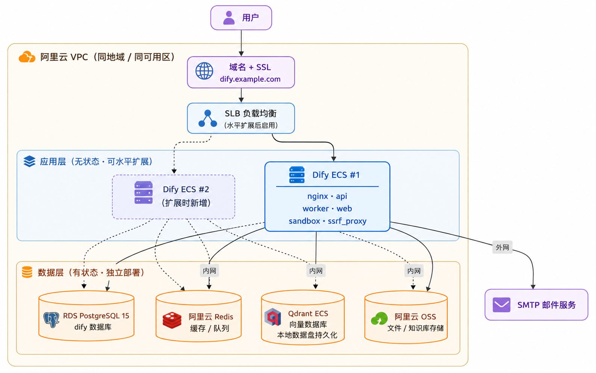

> 一份从踩坑到落地的生产级 Dify 私有化部署经验总结，帮助你绕开官方一键部署到生产环境之间的那道鸿沟。

## 为什么不直接用官方 docker-compose

最近把 Dify 真正放到生产环境上跑了一遍，过程比预想要曲折。官方仓库里那份 `docker/docker-compose.yaml` 一行命令就能拉起完整一套服务，看上去很方便，但实际用过会发现它的定位是「快速体验」，离能承载业务的生产环境差得比较远。

差别主要在这几件事上：

- 有状态组件（PostgreSQL、Redis、向量库）和无状态组件全部堆在一份 compose 里，升级、备份、扩容都会互相牵扯；
- 单机部署，没法水平扩展；
- 默认 `.env` 接近 400 行，真出问题时不知道从哪里下手；
- 数据都压在本地卷上，机器一挂全没。

我自己折腾完之后，把整个过程整理成这一篇，包括架构怎么拆、组件怎么选、踩过哪些坑，以及一份填完坑之后可以直接改值就用的 `.env` 和 `docker-compose.prod.yaml`。希望能让做类似事情的人省掉一些反复试错的时间。

## 架构拆分的思路

整套架构里我最看重的判断其实只有一个：**把有状态和无状态彻底分开。**

有状态组件——PostgreSQL、Redis、Qdrant——丢一次数据就回不来了，必须独立部署、独立备份、独立监控。无状态组件——API、Worker、Web、Sandbox、Plugin Daemon——挂了重启就行，可以放心扩缩容。这个边界划清楚之后，后续的所有事都顺了：应用层挂了不会丢数据，数据层升配不会影响应用，要水平扩展前面套个 SLB 再复制一台 ECS 就行。

最终落到这样一张架构图：



几个具体的设计点：

1. 所有阿里云资源放在同一个 VPC 内走内网通信，延迟低、流量基本不计费，也更安全；
2. 初期一台 ECS 跑应用层完全够用，需要扩容再前置 SLB；
3. 只有 SMTP 走外网，如果用阿里云邮件推送 DM 还可以改成内网；
4. 备份策略只需要盯 RDS、Redis（持久化）、OSS 三个地方，简单清晰。

组件选型最后是这样的：

| 组件         | 选型                     | 说明                |
| ------------ | ------------------------ | ------------------- |
| 关系型数据库 | 阿里云 RDS PostgreSQL    | 托管服务，自动备份  |
| 缓存         | 阿里云 Redis             | 托管服务            |
| 向量数据库   | 独立 ECS + Qdrant Docker | 成本与性能平衡      |
| 应用层       | ECS + docker-compose     | 无状态，便于扩展    |
| 对象存储     | 阿里云 OSS               | 文件 / 知识库存储   |
| 邮件         | SMTP 服务                | 用户激活 / 通知     |
| 域名         | 备案域名 + 二级域名      | 如 dify.example.com |

向量库这一项我犹豫了一下。阿里云有托管向量服务，但小规模阶段性价比偏低，而 Dify 对 Qdrant 的支持很成熟，所以最后还是自建了一台 ECS。后续数据量上来要切到托管或者 Qdrant 集群都不算难。

## 前期资源准备

下面这些资源建议提前一次性都准备好，部署的时候才不会卡在某个白名单或者证书上。

**区域规划。** 所有资源必须选在同一个地域和同一个可用区。这点一开始很容易忽略，等部署到一半才发现 ECS 在杭州、RDS 在上海，就只能拆了重来。同地域同可用区可以走 VPC 内网通信，速度快、流量不计费，安全边界也更清晰。

**阿里云 RDS PostgreSQL。** 实例规格前期不用买太高，2 核 4G 入门规格就够先跑起来，后续升配很方便。

版本必须选 15。阿里云控制台默认会推荐 18，但 Dify 的 migration 脚本里自定义了一个 `uuidv7()` 函数，而 PG 18 原生就提供了同名函数，撞名之后迁移直接挂掉。RDS 不支持降版本，选错了只能重建实例。

数据库初始化时准备两个 database 和一个专用账号：

```
dify
dify_plugin

用户名：dify_user
权限：dify 和 dify_plugin 两个库的读写 / 建表权限
```

把 Dify ECS 的内网 IP 加进 RDS 白名单，再从 ECS 用一个临时容器测连通性：

```bash
docker run --rm -it postgres:15-alpine psql \
  "postgresql://dify_user:<RDS密码>@<RDS内网地址>:5432/postgres" \
  -c "select version();"
```

返回版本号就说明 ECS 到 RDS 通了，再确认一下版本是 15。顺带提一句，连接串里如果密码包含 `!`、`@`、`#`、`%`、`/` 这类特殊字符，必须 URL 编码（比如 `!` 写成 `%21`），否则解析会出错。

**阿里云 Redis。** 主要扛缓存和 Celery 队列，前期 1G 入门版够用。创建之后记得设置访问密码，然后开 VPC 白名单。

```bash
docker run --rm -it redis:7-alpine redis-cli \
  -h <Redis内网地址> -p 6379 -a '<Redis密码>' ping
```

返回 `PONG` 就 OK。Redis DB 分配建议 `REDIS_DB=0` 给 Dify 自身缓存，`CELERY_BROKER_URL` 走 `/1` 给 Celery 队列。Dify 官方文档也明确提醒这两边不要冲突——Celery 默认 broker 格式就是 `redis://.../<redis_database>`，分开能避免互相干扰。

**独立部署 Qdrant。** 向量库我单独开了一台 ECS 跑 Qdrant 容器，规格重点关注内存和磁盘：内存决定能加载多少索引，磁盘决定能存多少文档块，2 核 4G + 100G SSD 起步比较舒服。

步骤大致是：装好 Docker → `docker pull qdrant/qdrant` → 准备一份 `config/config.yaml` 配置持久化路径和 `api-key`（一定要开 api-key，不开就是裸奔）→ 启动容器并挂载数据盘 → 安全组只对 VPC 内网开放 `6333` 和 `6334`。

从 Dify ECS 测一下连通性：

```bash
curl -s http://<Qdrant内网IP>:6333/collections \
  -H "api-key: <Qdrant_API_KEY>"
```

返回 `{"result":{"collections":[]},"status":"ok",...}` 就说明通了。

**其他基础设施。** 剩下几件零碎但少不了的：备案过的域名 + 二级域名（例如 `dify.example.com`）；SMTP 邮箱（这里以阿里云企业邮为例）；阿里云 OSS Bucket 和 AccessKey；SSL 证书（阿里云免费 DV 就够，下载 Nginx 版本备用）。

## 部署应用层

应用层 ECS 我建议至少 4 核 8G + 100G 系统盘。Plugin Daemon 装插件时会用 `uv` 构建虚拟环境，内存太小很容易被 OOM Killer 杀掉。

环境准备很简单：装好 Docker 和 docker compose（版本 ≥ 2.20），给应用建一个独立目录，比如 `/opt/dify-prod`。源码层面我们不需要编译，只用到 `docker/` 目录下的 Nginx 模板、Sandbox 配置、SSRF Proxy 配置这些静态资源。国内访问 GitHub 不太稳定，从 Gitee 镜像拉就行：

```bash
git clone https://gitee.com/dify_ai/dify.git
cd dify
git checkout <稳定版本 tag>
```

选 tag 时挑一个已经发布一段时间、社区反馈稳定的版本，不用追最新。我这次用的是 `1.14.2`。

官方那份 `docker-compose.yaml` 我没有直接复用，原因有几个：它把所有可选向量库（Weaviate、Qdrant、Milvus、PGVector 等）的服务定义都堆在一起靠 profile 切换；配置项又多又乱；并且包含了我们已经独立部署的组件（PG、Redis、Qdrant），后续维护起来太重。所以我重新写了一份精简版，只保留真正要跑的无状态组件（api、worker、worker_beat、web、sandbox、plugin_daemon、ssrf_proxy、nginx），并且在底部显式指定了 Docker 网段——这块和踩坑相关，下面会单独讲。

整套部署最关键的就是两份文件：

- 完整的 [docker-compose.prod.yaml](/files/dify/docker-compose.prod.yaml)
- 完整的 [.env.example](/files/dify/.env.example)（所有敏感信息已替换为占位符）

compose 文件基本拿过去改个版本号就能用，没有需要逐项理解的地方。`.env` 配置块比较多，下面挑几个**必须根据自己环境改值、并且容易出错**的关键块单独说一下，其余的部分（Sandbox、Plugin Daemon、Nginx、SSRF Proxy 等）保持模板默认即可。

**PostgreSQL（RDS）**

```bash
DB_TYPE=postgresql
DB_USERNAME=dify_user
DB_PASSWORD=<RDS 数据库密码>
DB_HOST=<RDS 内网地址，例如 pgm-xxxxxxxx.pg.rds.aliyuncs.com>
DB_PORT=5432
DB_DATABASE=dify
DB_PLUGIN_DATABASE=dify_plugin
DB_SSL_MODE=disable
```

`DB_DATABASE` 是 Dify 主库，`DB_PLUGIN_DATABASE` 是 plugin_daemon 单独使用的库，这两个库要提前在 RDS 里建好。密码里如果有特殊字符不用在这里编码，但 `CELERY_BROKER_URL` 那一行的密码需要 URL 编码。

**Redis**

```bash
REDIS_HOST=<Redis 内网地址>
REDIS_PASSWORD=<Redis 密码>
REDIS_DB=0
CELERY_BROKER_URL=redis://:<URL编码后的Redis密码>@<Redis内网地址>:6379/1
```

注意两点：`REDIS_DB=0` 给 Dify 自身缓存，`CELERY_BROKER_URL` 走 `/1` 给 Celery 队列，分开避免互相干扰；`CELERY_BROKER_URL` 里的密码必须 URL 编码（`!` 写成 `%21` 这种）。

**向量库（Qdrant）**

```bash
VECTOR_STORE=qdrant
VECTOR_INDEX_NAME_PREFIX=prod_
QDRANT_URL=http://<Qdrant ECS 内网 IP>:6333
QDRANT_API_KEY=<Qdrant 的 api-key>
```

`VECTOR_INDEX_NAME_PREFIX` 用来区分环境（比如开发环境前缀写 `dev_`），后面如果同一台 Qdrant 同时被多个环境用，靠这个前缀隔离 collection。

**文件存储（OSS）**

```bash
STORAGE_TYPE=aliyun-oss
ALIYUN_OSS_BUCKET_NAME=<你的 OSS Bucket 名>
ALIYUN_OSS_ACCESS_KEY=<AccessKey ID>
ALIYUN_OSS_SECRET_KEY=<AccessKey Secret>
ALIYUN_OSS_ENDPOINT=https://oss-cn-hangzhou-internal.aliyuncs.com
ALIYUN_OSS_REGION=cn-hangzhou
```

`ALIYUN_OSS_ENDPOINT` 一定要用 `internal` 内网域名，走外网不仅慢，还会被计算公网流量费。`.env.example` 里 `PLUGIN_*` 开头那一组配置实际上是把 plugin_daemon 的存储也指向了同一个 OSS Bucket，避免本地盘被插件文件撑满。

**对外访问地址**

```bash
CONSOLE_API_URL=https://dify.example.com
CONSOLE_WEB_URL=https://dify.example.com
SERVICE_API_URL=https://dify.example.com
APP_API_URL=https://dify.example.com
APP_WEB_URL=https://dify.example.com
FILES_URL=https://dify.example.com
TRIGGER_URL=https://dify.example.com
```

这一串全部填你的对外域名。没配 HTTPS 之前可以先写 `http://`，证书装好后统一改成 `https://`。

**SMTP**

```bash
MAIL_TYPE=smtp
MAIL_DEFAULT_SEND_FROM=Dify <no-reply@example.com>
SMTP_SERVER=smtp.qiye.aliyun.com
SMTP_PORT=465
SMTP_USERNAME=no-reply@example.com
SMTP_PASSWORD=<SMTP 授权密码>
SMTP_USE_TLS=true
```

`SMTP_PASSWORD` 是邮箱客户端的「授权密码」，不是登录密码，阿里云企业邮在邮箱设置里单独生成。

**密钥与初始密码**

部署前需要准备两类凭据：随机密钥和服务间通信密钥，以及首次登录用的管理员初始密码。

`SECRET_KEY` 是 Dify 签名 session 和 token 用的主密钥，用 `openssl rand -base64 42` 生成即可，不要和其他密钥复用。

`INIT_PASSWORD` 是首次启动时初始化管理员账号的密码。注意不要超过 20 位——太长会导致初始化登录报错、无法进入系统。第一次用该密码登录成功后，请及时修改管理员密码。

Sandbox 和 Plugin Daemon 各自还有一对服务间通信密钥，同样用 `openssl rand -base64 42` 生成：

- `SANDBOX_API_KEY` 与 `CODE_EXECUTION_API_KEY` 必须填同一个值；
- `PLUGIN_DAEMON_KEY` 与 `PLUGIN_DIFY_INNER_API_KEY` 建议保持一致。

## 启动与验证

两个文件准备好，再把官方仓库 `docker/` 下的 `nginx/`、`ssrf_proxy/`、`volumes/` 这些目录拷过来，就可以启动了：

```bash
docker compose -f docker-compose.prod.yaml up -d
docker compose -f docker-compose.prod.yaml ps
docker compose -f docker-compose.prod.yaml logs -f api worker plugin_daemon
```

启动完成之后我习惯按这一份清单走一遍闭环测试，每一步对应一条关键链路，能跑通基本就说明这块没问题：

1. 浏览器访问域名，能进登录页 → Nginx + Web；
2. 用 `INIT_PASSWORD` 登录 → API + RDS；
3. 创建一个模型供应商配置 → API；
4. 安装一个插件 → Plugin Daemon + PyPI 镜像 + OSS；
5. 上传一个小文件 → OSS；
6. 创建知识库并执行一次文档索引 → Qdrant 写入；
7. 创建一个简单工作流并运行 → Sandbox。

如果某一步报错，日志命令里加上对应服务名定向看就行，不用一开始就 `logs -f` 全量盯。

## 踩过的几个坑

下面这几个坑是我自己踩过来花了不少时间才搞清楚的，单独拎出来记一下。

### 插件安装报 `signal: killed`

部署完登录都正常，但只要点安装插件就报：

```
failed to launch plugin: failed to install dependencies:
failed to install dependencies: signal: killed
```

`plugin_daemon` 在用 `uv` 给插件下载依赖时被进程杀掉了。常见原因两个：内存不足被 OOM Killer 杀，或者 PyPI 下载太慢直接超时被杀。我这台 ECS 内存很健康，排除前者，剩下就是默认走国外 PyPI 太慢。

解决办法是在 `.env` 里加这三行：

```bash
PIP_MIRROR_URL=https://mirrors.aliyun.com/pypi/simple/
PLUGIN_IGNORE_UV_LOCK=true
PYTHON_COMPILE_ALL_EXTRA_ARGS=-x \.venv
```

`PIP_MIRROR_URL` 让依赖走阿里云镜像；`PLUGIN_IGNORE_UV_LOCK=true` 让 `uv` 不死盯插件原始 lock 文件，配合镜像源重新解析依赖；`-x \.venv` 跳过对虚拟环境的字节码预编译，能明显降低初始化时的 CPU 消耗。这三个参数 Dify plugin-daemon 官方 README 都有推荐，但默认 `.env.example` 不会带上，第一次部署很容易漏。

### Redis 连接 `i/o timeout`

API 启动一切正常，但只要碰 Redis 操作就报：

```
redis.exceptions.ConnectionError: Error 113 connecting
dial tcp 172.18.25.239:6379: i/o timeout
```

阿里云 Redis 的内网 IP 是 `172.18.25.239`，而 Docker Compose 默认创建的 bridge 网络也经常落在 `172.18.0.0/16` 这个段里。结果就是容器把 `172.18.25.239` 当成 Docker 内部地址，根本不会把流量转出 VPC。

解决办法是在 compose 里显式指定 Docker 网段，避开阿里云 VPC 常用的 `172.x.x.x`：

```yaml
networks:
  default:
    driver: bridge
    ipam:
      config:
        - subnet: 192.168.240.0/24
          gateway: 192.168.240.1
  ssrf_proxy_network:
    driver: bridge
    internal: true
    ipam:
      config:
        - subnet: 192.168.241.0/24
          gateway: 192.168.241.1
```

这是阿里云 + Docker 这套组合下非常经典的一个坑，部署前最好先看一眼 RDS、Redis 的内网 IP 段，再决定 Docker 用什么网段。

### PostgreSQL 版本必须是 15

用阿里云推荐的 PG 18 部署，第一次启动 migration 就挂：

```
function uuidv7() is not unique
```

Dify migration 脚本里自定义了一个 `uuidv7()`，而 PG 18 原生提供了同名函数，撞名后函数解析失败，迁移直接卡死。GitHub 上已经有相关 issue，PG 官方文档也明确写了 18 引入了 `uuidv7()`。

最干脆的解法就是一开始就买 PG 15。RDS 不支持降版本，选错了只能重建实例。如果已经买了 18，手动改 migration 跳过冲突也能跑通，但每次 Dify 升级都要重新打补丁，不划算。

### `LC_ALL` warning

启动日志里经常看到这两行：

```
/bin/bash: warning: setlocale: LC_ALL: cannot change locale (en_US.UTF-8)
/entrypoint.sh: line 8: warning: setlocale: LC_ALL: cannot change locale (en_US.UTF-8)
```

不影响功能但看着烦。在 `.env` 里加：

```bash
LANG=C.UTF-8
LC_ALL=C.UTF-8
PYTHONIOENCODING=utf-8
```

Dify 镜像里本来就是 `C.UTF-8`，强制对齐就不会再报警告。

## 后续可以继续做的事

跑稳之后下一步可以朝几个方向继续优化，按需推进即可。

水平扩展：文件全部走 OSS、session 走 Redis，应用层本来就具备横向扩展条件，加一台 ECS 前面套个 SLB 就能扩。

高可用：RDS 和 Redis 都开主备实例，关键参数调成同步复制；Qdrant 升级为多副本集群部署；应用层做好健康检查 + 自动重启，最好接入 ECS 自愈。

可观测性：日志用阿里云 SLS 或自建 Loki 统一收集；监控重点盯数据库连接数、Redis 内存、Qdrant 查询延迟、API 5xx 比例；链路追踪可以接 Jaeger 或阿里云 ARMS，Dify 已经原生支持 OpenTelemetry。

备份与容灾：RDS 自动备份开起来（每天全量 + 增量，保留至少 7 天）；Qdrant 用 snapshot 接口定期备份到 OSS；OSS 配置跨区域复制。

## 一点小结

回头看整套部署，最值钱的判断其实就一句：**有状态和无状态彻底分开。** 拆完之后所有复杂度都被分摊到了各自的领域里，数据库、应用、向量库可以各自演进、各自升配、各自备份，不会一个挂全挂。

前期多花点时间把架构画清楚、把那几个版本和网络的坑踩完，换来的是后续比较长一段时间不用大动结构的可维护性。剩下的事就是把监控、备份、扩展这些按需补齐。希望这份记录能让正在走同样路的人少踩几个坑，把 Dify 真正用到业务里去。
