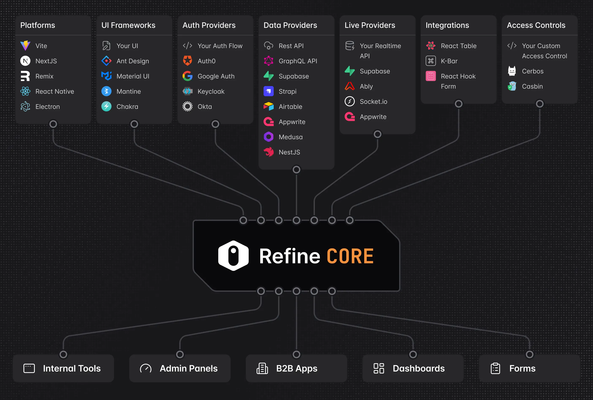

最近在做技术选型时，我接触到了一个叫 Refine 的前端框架。

刚看到它的时候，我有些困惑。它看起来像一个管理后台框架，但又不像传统的后台模板；它提供表格、表单相关能力，却又不是 Ant Design 这样的组件库；它基于 React，但也不是 Next.js 那种通用应用框架。

进一步了解后，我对 Refine 的理解逐渐清晰了：

> Refine 是一个专门用来构建数据密集型 React 应用的元框架。

它最适合的不是企业官网、活动页面或者内容展示站，而是管理后台、内部工具、CRM、ERP、工单系统、商家控制台等业务系统。

这些系统通常有一个共同特点：页面里充满了表格、表单、查询、筛选、分页、权限和增删改查。

Refine 解决的，正是这类系统中大量重复的基础工作。



上图里 Refine 处在中间层：上方接入平台、UI、认证、数据源和权限，下方通向内部工具、管理后台、B2B 应用等业务系统。

## 资源驱动，不是页面驱动

假设要开发一个订单管理后台。

从用户视角看，这个系统可能只是一个订单列表。用户可以搜索订单、查看详情、修改状态或者删除订单。

但从开发视角看，一个看似简单的列表页面背后往往包含很多工作：

- 请求订单数据
- 处理加载和错误状态
- 管理分页、排序和筛选条件
- 把查询条件同步到 URL
- 编辑订单后刷新列表
- 判断当前用户是否有操作权限
- 未登录时跳转到登录页面
- 操作成功或失败后显示提示
- 处理缓存和重复请求

这些功能都可以单独实现。

我们可以使用 React Router 管理路由，使用 TanStack Query 管理请求和缓存，使用 React Hook Form 管理表单，再自己实现登录状态、权限判断和通知系统。

问题在于，把这些库连接起来会产生大量胶水代码。

每开发一个新的业务模块，都可能重新处理一遍列表查询、分页、表单提交、缓存刷新和权限判断。

Refine 的作用，就是把这些常见能力按照后台系统的业务模式组织起来。

它不是简单地替你发送一个请求，而是知道当前页面正在管理某一种业务数据，并围绕这种数据提供完整的操作流程。

例如，当页面管理的是订单时，Refine 会把订单视为一个 Resource，也就是“资源”。

一个资源通常对应一个业务实体：

```text
users       用户
products    商品
orders      订单
customers   客户
tickets     工单
invoices    发票
```

资源可以拥有列表、详情、创建、编辑和删除等操作。

一旦定义了订单资源，路由、数据请求、缓存刷新、权限判断和页面跳转就可以围绕它建立联系。

因此，Refine 最核心的设计不是“页面驱动”，而是“资源驱动”。

## 它最大的特点是 Headless

Refine 经常强调自己是 Headless 框架。

简单来说，Headless 就是：

> Refine 主要负责数据和业务逻辑，但不强制页面长什么样。

它可以处理列表查询、分页、筛选、表单提交、缓存更新和权限判断，但不会要求你必须使用某一种固定的表格或者页面布局。

界面层可以使用：

- Ant Design
- Material UI
- Mantine
- Chakra UI
- Tailwind CSS
- 公司自己的组件库

这也是 Refine 和很多传统后台模板之间的重要区别。

传统后台模板通常会同时提供菜单、布局、表格、表单和视觉风格。它们上手很快，但项目做久以后，往往会遇到页面风格固定、定制成本高的问题。

Refine 更像是提供后台系统内部的管道和结构。

它负责告诉页面：

- 数据从哪里来
- 当前加载到第几页
- 使用了哪些筛选条件
- 保存成功后刷新哪些数据
- 当前用户是否可以执行某个操作

至于最终使用表格、卡片还是自定义布局，仍然由开发者决定。

这意味着 Refine 很适合已经有设计规范或者内部组件库的团队。

团队不需要放弃现有 UI，只需要把 Refine 当成业务逻辑层使用。

## 优势：减少重复决策

Refine 提供了多个 Provider，用来连接不同的基础能力。

Data Provider 负责连接后端接口，Auth Provider 负责登录和身份状态，Access Control Provider 负责权限判断，Router Provider 负责路由，Notification Provider 负责操作提示。

这种设计的好处是，上层业务代码不必过度依赖具体实现。

例如，页面只需要表达“获取订单列表”，至于数据来自 REST API、GraphQL、Supabase 还是公司内部服务，可以交给 Data Provider 转换。

这让 Refine 很像一个标准插口。

上层页面使用统一方式操作数据，底层再通过适配器连接不同后端。

Refine 另一个实际优势，是它把很多后台系统中的常见需求纳入了统一模型。

例如数据修改通常有几种不同体验：

- 等服务器返回成功后再更新页面
- 先更新页面，服务器失败时再回滚
- 先执行操作，同时允许用户在几秒内撤销

这些效果自己实现并不困难，但当系统中有大量类似操作时，统一的处理方式会明显降低维护成本。

权限也是同样的道理。

后台系统里的权限通常不是简单的“登录”和“未登录”，而是：

- 管理员可以查看、创建、修改和删除
- 运营人员可以查看和修改，但不能删除
- 审核人员只能处理待审核数据
- 普通员工只能查看自己部门的数据

Refine 不会替项目决定权限规则，但它提供了一套统一的询问方式：

> 当前用户能不能对这个资源执行这个操作？

这样一来，菜单、页面、按钮和路由可以围绕同一套权限逻辑工作。

真正需要注意的是，前端权限只能控制页面展示和用户体验。真正的安全校验仍然必须放在后端。

## Refine 和常见框架是什么关系

理解 Refine 时，很容易把它和其他工具混在一起。

它和 Ant Design 不是竞争关系。

Ant Design 提供按钮、输入框、表格、弹窗等 UI 组件；Refine 处理的是表格数据如何加载、分页如何与接口联动、保存后如何刷新缓存，以及当前用户有没有权限操作。

可以简单理解为：

> Ant Design 负责页面长什么样，Refine 负责页面如何运转。

它和 Next.js 也不是替代关系。

Next.js 更关注整个应用的运行方式，包括路由、服务端渲染、数据获取和部署；Refine 更关注业务资源、CRUD、表格、表单、认证和权限。

在实际项目中，完全可以同时使用 Next.js、Refine 和 Ant Design。

它们分别负责不同层次的问题。

Refine 最直接的同类产品是 React Admin。

React Admin 更接近一套完整的后台开发框架，默认能力比较完整，适合快速搭建标准管理后台。

Refine 则更强调组合能力和 Headless。它给开发者更大的自由，但也意味着开发者需要自己做更多界面和架构决策。

可以把二者粗略理解为：

> React Admin 像一间已经装修好的办公室，Refine 更像一套标准化的水电、网络和空间结构。

前者适合快速入住，后者适合按照自己的需求装修。

Refine 也不同于 Retool 这类低代码工具。

Retool 主要通过可视化编辑器和平台能力快速搭建内部工具，Refine 仍然是一个代码优先的 React 框架。

使用 Refine 仍然需要编写 TypeScript、React 组件、表单和业务逻辑。

它减少的是重复代码，而不是消除开发工作。

## 什么项目适合使用 Refine

Refine 比较适合以下类型的项目：

- 已经有后端 API 的管理系统
- 页面中存在大量表格和表单
- 需要分页、筛选、搜索和排序
- 存在复杂的角色和权限
- 使用 React 和 TypeScript
- 已经有自己的设计系统
- 项目会长期维护并持续增加业务模块

典型场景包括：

- 电商管理后台
- CRM 客户管理系统
- ERP 系统
- 库存和物流系统
- 工单平台
- 内容审核系统
- 财务录入平台
- B2B SaaS 控制台

这些系统通常都可以被拆成一个个资源。

商品、订单、用户、客户和工单，本质上都是不同的业务资源。围绕这些资源，又会不断出现列表、详情、创建、编辑和删除等操作。

这正好符合 Refine 的设计方式。

反过来说，如果项目只是企业官网、博客、活动页面或者简单展示站，Refine 通常没有太大价值。

对于在线绘图、视频剪辑、游戏、3D 编辑器等强交互应用，Refine 也很难成为核心框架，因为这些产品的主要复杂度并不在 CRUD。

后端接口是否规则也会影响 Refine 的使用体验。

如果后端接口比较标准，数据能够自然映射为列表、详情、创建、更新和删除，Refine 会使用得很顺畅。

如果后端全部是特殊 RPC，一个页面要调用大量无法归类的业务接口，那么开发者可能需要编写很多适配代码。此时 Refine 带来的收益会下降。

## 使用 Refine 也有成本

Refine 增加了一层抽象。

原本页面可能直接请求 API，使用 Refine 后，请求会经过 Hook、Data Provider 和缓存层。

当系统出现问题时，开发者需要理解这些层次之间的关系。

它的高自由度也意味着团队需要做出更多选择，例如使用什么路由、什么 UI 库、如何组织目录、如何设计 Provider，以及哪些模块应该使用 Refine。

因此，Refine 不是一个“引入之后什么都不用考虑”的框架。

它更适合具备一定 React 工程经验，并且真正面临大量后台业务重复工作的团队。

## 最后如何理解 Refine

现在回头看，Refine 并不是一个后台模板，也不是简单的 UI 组件库。

它更像是一套 React 业务应用的基础设施。

React 提供组件和状态能力，UI 组件库提供页面元素，Next.js 提供应用运行框架，而 Refine 负责把 API、资源、CRUD、表单、路由、缓存、认证和权限连接起来。

它最有价值的地方，不是让一个简单页面少写几十行代码，而是让一个不断扩展的业务系统始终使用相对统一的方式组织数据和操作。

判断是否应该使用 Refine，可以问自己一个问题：

> 当前项目是不是一个以业务资源为中心、CRUD 比重较高、需要深度定制的 React 数据应用？

如果答案是肯定的，Refine 值得认真考虑。

一句话总结：

> Refine 不是帮你画出一个管理后台，而是帮你建立一套让管理后台长期运转的业务骨架。
