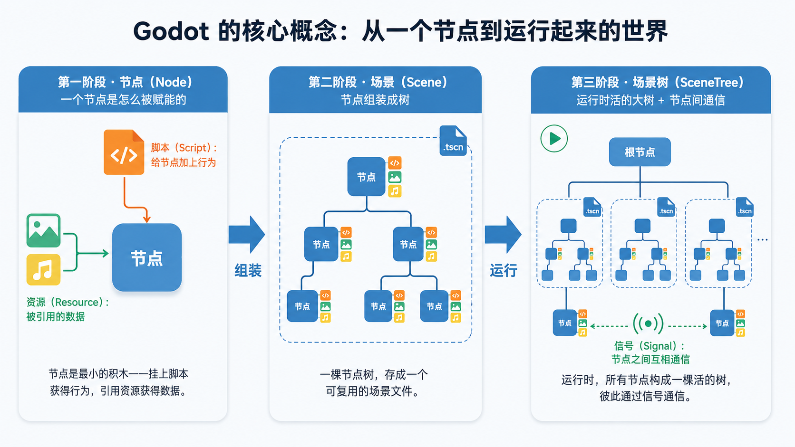

---

title: '第一次用 Godot：项目结构、核心概念，与如何继续深入'

pubDate: 2026-06-26

categories: ['游戏开发', 'Godot']

series:
  name: 'Godot 与游戏开发笔记'
  order: 2

draft: false
---

这篇写给已经决定试试 Godot、把它下载下来、第一次打开却有点不知所措的人——这也是不久前的我。

具体怎么操作，跟着任意一个上手教程做一遍就会了。真正容易卡住的，是脑子里没有一张整体的图：这个项目到底由什么组成、那几个反复出现的术语是什么意思、起步该往哪走、之后想深入又该往哪走。这篇就想把这张图给你画出来。

## 获取与安装 Godot

Godot 从[官网](https://godotengine.org/)直接下载就行。它有几个让人很舒服的特点：**免安装**（下载下来是一个可执行文件，解压即用）、**体积小**（几十 MB）、**跨平台**（Windows、macOS、Linux 都有）。这一点和动辄几个 GB、要走安装器的大型引擎很不一样。

你会看到两个版本：

- **标准版**：只支持 GDScript（Godot 自己的脚本语言）。
- **.NET 版**：在标准版基础上额外支持 C#。

我的建议很明确：**第一次学就用标准版，从 GDScript 入手**。GDScript 和引擎结合最紧、教程最多、对新手最友好。等你确实需要 C#（比如想用某个 C# 生态的库，或团队要求），再换 .NET 版也不迟。别在版本选择上一开始就纠结。

## 新建项目时，你其实在选什么

第一次打开 Godot，迎接你的不是编辑器，而是**项目管理器**——一个列出你所有项目、并能新建项目的窗口。新建时有几个选项，与其记"点哪里"，不如先弄懂它在问你什么。

**项目名和项目路径**：一个 Godot 项目就是一个文件夹。你给它起个名、选个空文件夹放它，仅此而已。这一点先记住，下一节我们就来拆开这个文件夹看里面有什么。

**渲染器（Renderer）**：这里要你三选一，它决定了引擎用哪套方式把画面画出来。简要区别如下：

- **Forward+**：面向较新的桌面硬件，画质和高级 3D 效果最好，但对老设备、移动端和网页不友好。
- **Mobile**：为移动设备优化，桌面上也能跑，是性能和效果的折中。
- **Compatibility**：基于较老的图形接口（OpenGL），兼容性最好，能跑在老硬件、移动端和网页上，代价是没有那些高级 3D 效果。

对一个**做 2D、或者想要最大兼容性**的新手来说，选 **Compatibility** 是最稳妥的默认。它跑得动的设备最多，而你入门阶段也用不上 Forward+ 那些重型 3D 特性。这个选项之后也能在项目设置里改，不必现在想太多。

## 读懂 Godot 的项目文件夹结构

这是我自己第一次打开 Godot 项目时最想搞清楚、却很少有教程正经讲的东西。理解了文件结构，你才知道自己的东西放在哪、引擎在背后替你管了什么、哪些该备份、哪些可以随手删。

### `project.godot`：项目的身份证

文件夹里有没有这个文件，决定了它是不是一个 Godot 项目。项目管理器就是靠扫描 `project.godot` 来识别项目的。它是一个文本文件，记录着项目的各种设置——入口场景是哪个、输入映射怎么配、窗口多大，等等。你在编辑器里改的"项目设置"，最终大多落在这里。

### `res://` 与 `user://`：两个最重要的路径前缀

在 Godot 里你会随处见到这两个以 `://` 结尾的前缀，它们是新手最容易困惑的点之一。其实它们是两个"虚拟根目录"：

- **`res://`** 指向你的**项目资源根目录**，也就是 `project.godot` 所在的那个文件夹。你的脚本、场景、图片、音频，全都在 `res://` 下面。游戏被导出打包后，这个目录通常是**只读**的。
- **`user://`** 指向一个**运行时可写**的用户数据目录。存档、配置、日志这类需要在玩家电脑上写入的东西，要放这里。它在不同操作系统上会落到各自的标准位置（Windows、macOS、Linux 各不相同），但你在代码里只管写 `user://`，引擎帮你翻译成实际路径。

为什么不直接用 `C:\游戏\存档.dat` 这样的绝对路径？因为那样换台电脑、换个系统、打包之后就全错了。`res://` 和 `user://` 这层抽象，正是为了让你的游戏**跨平台、打包后依然能正确找到文件**。

### `.godot/` 与 `.import`：引擎自动生成的东西

你会注意到项目里有些不是你创建的东西：

- **`.godot/`** 是引擎的**缓存目录**。你导入的资源转换后的结果、各种索引都堆在这。它是自动生成的，你不用管它，**删了也会重新生成**。
- 每一个被导入的素材（比如一张 png）旁边，会多出一个同名的 **`.import`** 文件，记录这个素材的导入设置。

这正呼应了"资产管线"：你往项目里放一张图，Godot 不会直接用它，而是**导入**它——生成 `.import` 记录设置、把转换结果缓存进 `.godot/`。

如果你用 Git 做版本管理，一个实用建议是：**忽略 `.godot/`（缓存，不必提交），但保留 `.import` 文件**（它记录了导入设置，别人拉下来才能正确还原）。

### 一个推荐的文件夹划分

Godot **不强制**你的目录怎么组织——这是自由，但也意味着你得自己立规矩，否则项目大了会乱成一团。给个务实的起步方案，按资源类型分目录：

```
res://
├── scenes/    场景文件（.tscn）
├── scripts/   脚本（.gd）
├── assets/    图片、精灵图等美术资源
└── audio/     音效与音乐
```

小项目这么分完全够用。等项目变大，你也可以改成"按功能模块分"（比如 `player/`、`enemy/` 各自放自己的场景、脚本、素材）。两种方式各有取舍，没有绝对对错——**关键是保持一致**，别一半按类型、一半按模块。

## 编辑器：先建立一个心智模型

打开编辑器第一眼会有点信息过载：一堆面板、按钮、菜单。但其实你只要理解它大致分成几块、每块负责回答你什么问题，就不会慌了。

把编辑器理解成"四个问题的四个回答区"：

- **场景树（Scene 面板）** 回答：*"我当前这个场景由哪些节点组成、它们的父子关系是什么？"*
- **文件系统（FileSystem 面板）** 回答：*"我项目里有哪些文件？"*——它其实就是上一节那个 `res://` 目录的可视化。
- **视口（Viewport）** 回答：*"我的游戏世界现在长什么样？"*——中间那块大区域，可以在 2D、3D、脚本视图之间切换。
- **检查器（Inspector）** 回答：*"我选中的这个节点，有哪些属性可以调？"*——你入门阶段会有大量时间花在这里调参数。

有了这个分区的概念，再看任何教程都不容易迷路。比如它让你"在检查器里把某个值改成 X"，你立刻就知道该往哪儿看。

## Godot 的几个核心概念

下面这几个词，是你读任何 Godot 教程、文档都会不断撞见的。把它们理解透，比学会任何具体操作都重要——因为操作会变，概念不变。



### 节点（Node）：最小的积木

Godot 有一句几乎是信仰的设计哲学：**一切皆节点**。

一个节点，就是一个**只干一件事的小部件**：有的节点负责显示一张图片，有的负责检测碰撞，有的负责播放声音，有的是一台相机。它们种类繁多，但每个都很"专一"。你要做的，是把这些专一的小部件**组合**起来，搭出复杂的东西。这和"为每种游戏对象写一个大而全的类"是完全不同的思路——更像搭积木。

### 场景（Scene）：把节点组装成可复用的整体

当你把一组节点按父子关系组装好，存成一个文件（后缀是 `.tscn`），它就成了一个**场景**。

这里有个新手最常见的误解需要打破：**"场景"不等于"关卡"**。在 Godot 里，场景可大可小——一整个关卡是场景，一个角色是场景，甚至一个按钮也可以是场景。而且场景能**嵌套和复用**：你把"敌人"做成一个场景，就能在关卡场景里放进一百个它的实例；改动敌人那个场景，所有实例一起更新。这正是 Godot 复用的核心方式。

### 场景树（SceneTree）：运行起来后那棵活的树

前面说的场景是"躺在硬盘上的文件"。当游戏真正跑起来，所有当前存在的节点会构成一棵**活的树**，引擎每一帧都在遍历、更新它。这棵运行时的树就叫场景树。

理解它有两个要点。一是**父子关系会传递**：父节点移动，挂在它下面的子节点会跟着一起动——这让你能把一个角色和它的武器、血条绑在一起整体操控。二是节点有**生命周期**：它被加入树时、每一帧、被移出树时，引擎都会在特定时机"招呼"你的脚本一声（比如节点准备好时、每帧更新时），你把对应的逻辑写进去就行。具体的回调名字，用到时查文档即可。

### 脚本与 GDScript：给节点加上"行为"

节点本身只有引擎赋予的那点基础能力。想让它按你的想法动起来——比如"按了右键就向右走"——你就给这个节点**挂一段脚本**。脚本是节点的"大脑"，写明它在各个生命周期时机该做什么。

Godot 主推的脚本语言是 **GDScript**：它是引擎自带的、专为游戏设计的语言，语法和 Python 非常像（靠缩进、很好读），和编辑器结合得也最紧密，对新手最友好。如果你装的是 .NET 版，也可以用 **C#**。入门阶段我建议就用 GDScript，把精力放在理解"脚本是怎么作用在节点上的"，而不是纠结语言选型。

### 信号（Signal）：节点之间的"广播"

这是 Godot 非常有特色、新手却最容易忽略的机制。

设想：按钮被按下了，需要让别的东西做出反应。笨办法是让按钮直接去"找"那个东西、调用它——但这样两者就死死绑在一起了。Godot 的做法是**信号**：按钮在被按下时，只管"广播"一声（它发出一个 `pressed` 信号），至于谁在听、听到后干什么，按钮一概不关心。任何需要响应的节点，自己去**连接**这个信号就行。

这套机制带来的好处叫**解耦**——发信号的一方不需要知道接收方是谁。这让你的各个部件能各管各的、互不纠缠，项目大了之后尤其重要。很多新手做着做着代码越缠越乱，往往就是因为没用好信号。

### 资源（Resource）：可被引用和复用的数据

在 Godot 里，图片、音频、字体、场景，乃至你自己定义的一组数据，本质上都是**资源**。

资源和节点的区别值得说清楚：**节点是场景树里"活着"的对象**，它在运行、在被更新；**资源是"被引用"的数据**，它本身不"动"。一份资源可以被很多个节点同时共享——比如同一张贴图，被场景里五十个敌人引用，内存里只存一份。这也正呼应了前面讲的 `res://` 和 `.import`：资源就是放在 `res://` 下、经过导入、再通过路径被各处引用和加载的东西。

## 怎么迈出第一步

认知有了，怎么开始动手？给一条你可以自己走、不依赖任何后续文章的路径：

1. **跟官方的入门教程做一个最小项目。** Godot 官方文档里有一个很经典的 "Your first 2D game"（做一个躲避障碍的小游戏）。它的价值不在于游戏本身，而在于带你把 **建场景 → 加节点 → 挂脚本 → 连信号 → 运行** 这条主线**亲手完整走一遍**。前面讲的所有概念，你会在这一遍里全部摸到。
2. **走完后，强迫自己改一点点。** 换个素材、加一个能捡的金币、改改速度。哪怕只是很小的改动，"离开教程自己想"这一步，才是真正开始学习的地方。
3. **重复做几个小到能在一两小时内跑通的东西。** 一个能左右移动的方块、一个能点的菜单、一个会掉下来的球。

核心原则一句话：**先求"能动、能玩"，别一上来就追求做完整大作。** 十个跑通的小东西，胜过一个烂尾的大项目。

## 后续如何继续深入

入门之后往哪走？给几个靠谱的"路标"，你不用现在就全看，知道它们存在、用到时回来找即可：

- **官方文档**：Godot 的官方文档质量相当高，结构清晰、例子实在。养成"遇到问题先查官方文档"的习惯，会让你比只刷视频快很多。这是最该常驻的地方。
- **官方示例项目 / Asset Library**：Godot 内置了一个 Asset Library，里面有大量现成的示例项目和插件。**下载一个现成小项目、拆开看它怎么搭的**，是进步飞快的学习方式。
- **进阶专题（用到再学）**：物理、UI 系统、动画（`AnimationPlayer`、`Tween`）、瓦片地图（`TileMap`）、音频总线、自动加载（做全局单例）、导出打包到各平台……这些都是"需要时再深入"的模块，没必要一口气吃下。
- **社区**：官方论坛和社区问答里，你遇到的大多数新手问题别人都问过。学会用准确的关键词搜索、必要时清楚地描述问题去提问，本身也是一项重要能力。

---

以上这些，就是你打开 Godot 之后最该先弄明白的东西：它的项目长什么样、那几个核心概念分别是什么、怎么动手、又能往哪深入。把这张图记在脑子里，接下来你想做什么，就取决于你想做一个什么样的游戏了。
