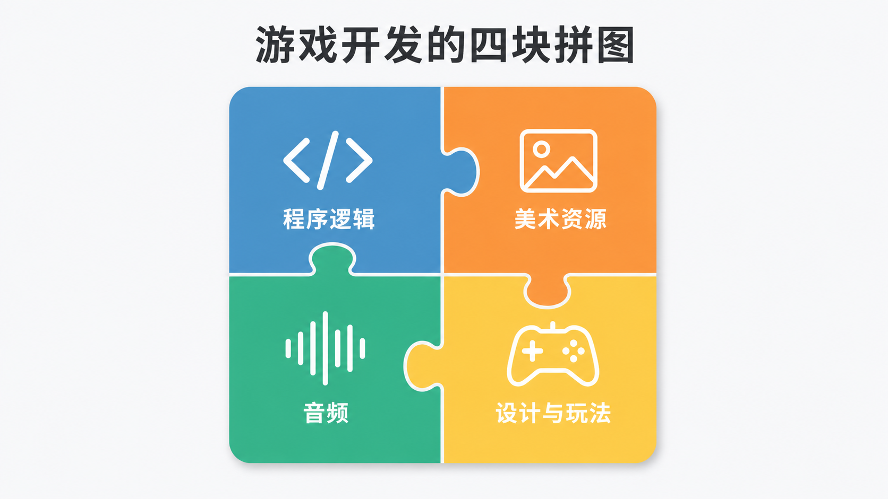
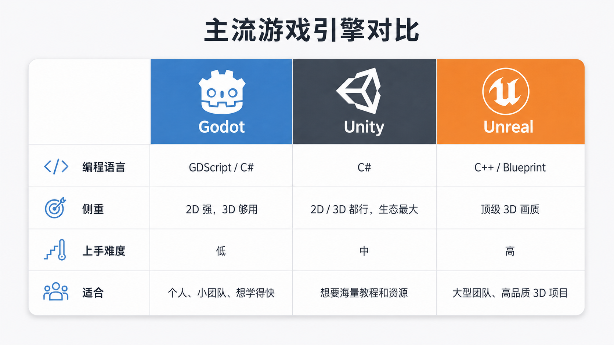

---

title: '第一次接触游戏开发，你需要先知道这些'

pubDate: 2026-06-25

categories: ['游戏开发', 'Godot']

series:
  name: 'Godot 与游戏开发笔记'
  order: 1

draft: false
---

写这篇文章的时候，我自己也才刚开始学 Godot。所以这不是一篇"过来人指点江山"的文章，而是我在真正动手之前，希望有人能先告诉我的那些事——关于游戏开发到底是怎么回事，关于引擎和那一堆概念在其中扮演什么角色。

如果你和我一样是第一次接触游戏开发，希望这篇能帮你建立一个大致的认知框架：知道接下来要学的东西大概长什么样、彼此之间是什么关系。这一篇不碰具体的 Godot 操作，只聊"不管你最后用哪个引擎都得先想明白"的事。

## 在动手之前，先想清楚一件事

我观察过很多人（包括一开始的我自己）入门游戏开发的方式：打开一个"30 分钟做出你的第一个游戏"的视频，跟着一步步敲，敲完了，游戏确实能跑。然后呢？然后就卡住了。

卡住的原因不是不会敲代码，而是**不知道自己刚才做的每一步到底是什么、为什么这么做**。视频里让你点哪里你点哪里，让你写什么你写什么，一旦离开教程想自己加个功能，立刻不知所措——因为你脑子里没有一张"地图"，只有一条别人帮你走过的路。

所以这一篇我不教任何操作。我想先帮你把地图画出来：游戏开发由哪些部分组成、引擎在中间帮你做了什么、有哪些通用的概念是你换任何引擎都会反复遇到的。**先有地图，再上路**，后面跟教程的时候，你才知道每一步落在地图的哪个位置。

## 游戏开发到底在做什么

第一个要破除的误解是：游戏开发 ≈ 写代码。

并不是。一个游戏能成立，是好几个领域拼在一起的结果。代码只是其中一块。先看清楚全貌，后面学东西的时候，你才知道自己正在拼图的哪一角。

### 程序逻辑

这是游戏的"规则"和"行为"：角色按了方向键怎么移动、子弹碰到敌人怎么算命中、分数什么时候加、血量归零怎么判定游戏结束。

这部分是写代码的地方，也是引擎脚本（Godot 里是 GDScript 或 C#）负责的部分。如果你有编程基础，这块会是你最熟悉的入口——但要注意，游戏里的代码思维和写一个普通后端程序不太一样，它是"每一帧都在运行"的，后面讲游戏循环时会细说。

### 美术资源

游戏得有画面。2D 游戏里是精灵图（sprite）、图集（图块拼成的地图素材）；3D 游戏里是模型、贴图、材质。

这里要破除第二个误解：**做程序的人不一定要会画画**。很多个人开发者用的是现成的免费或付费素材库。但你需要理解的是——这些美术资源是怎么"进"到引擎里、又怎么被代码引用的。这个"导入"的过程在每个引擎里都存在，理解它能帮你少踩很多"为什么我的图片显示不出来"的坑。

### 音频

音效（跳跃声、受击声、点击声）和背景音乐。它看起来不起眼，但对游戏手感和氛围的影响超出想象——同一个动作，加了"咔"的一声反馈，体验完全不同。

技术上它是相对独立的一块：你需要知道某个声音在什么时机被触发、由哪段逻辑去播放它。这一篇知道"它是单独一块拼图"就够了。

### 设计与玩法

这是最容易被技术人员忽略、却往往决定游戏好不好玩的一块：关卡怎么设计、难度曲线怎么安排、数值怎么平衡、节奏怎么把控。

我想特别强调：**玩法设计和写程序是两种思维**。代码写得再漂亮，玩法无聊，游戏就是不好玩；反过来，很多代码很糙的小游戏却让人停不下来。这一块没有标准答案，更多靠多玩、多想、多试。

---

把这四块放一起你会发现：一个人很难样样精通。所以独立开发者的常态，要么是"每块都懂一点、自己缝起来"，要么是"善用现成资源，把精力集中在自己最在意的那块"。而引擎的意义，就在于把**程序逻辑**这块底下最重复、最底层的脏活累活替你包掉，让你能专注在真正想做的事情上。

## 游戏引擎是什么，为什么需要它

想象一下，如果完全不用引擎，从零做一个游戏，你得自己解决这些问题：

- 怎么把一张图画到屏幕上，还要每秒画 60 次让它看起来在动；
- 怎么判断两个物体撞上了，撞上之后怎么按物理规律弹开；
- 怎么读取键盘、鼠标、手柄的输入；
- 怎么播放声音、怎么管理成百上千个素材文件；
- 怎么组织游戏里成千上万个对象，让它们各自更新自己的状态。

这些事情，**和你想做的那个游戏本身几乎没关系**，但每个游戏都要重做一遍。游戏引擎做的，就是把这些通用的底层能力——渲染、物理、输入、音频、资源管理、场景组织——提前封装好，给你一套现成的工具和接口。你只需要在它上面专心写"我的角色怎么动、我的关卡怎么设计"。

打个程序员熟悉的比方：**不用引擎做游戏，约等于不用任何框架、徒手撸 socket 写一个网站**。能不能做？能。但你会把 90% 的精力花在和你的业务毫无关系的底层管道上。引擎之于游戏，就像 Web 框架之于网站。

那么问题来了——既然都要用引擎，市面上有哪些可选？

## 主流引擎一览，以及怎么选

引擎只是工具，但选错工具会让入门变得很痛苦。这里我不吹不黑，把几个主流选项和它们的定位说清楚。

### Godot

开源、免费、完全没有版税和分成。体积很小（下载下来几十 MB，免安装），启动快。它的 2D 能力在主流引擎里数一数二，对个人和小团队特别友好。主力脚本语言是 GDScript（语法很像 Python，专为游戏设计），也支持 C#。

它的缺点是相对年轻，3D 的高端能力和生态资源还不如下面两个老牌引擎丰富，遇到冷门问题时能搜到的现成答案会少一些。

### Unity

商业独立游戏领域用得最广的引擎之一，用 C# 编程。最大的优势是**生态和教程极其丰富**——几乎你想做的任何东西，都能搜到现成的教程、插件和资源，这对新手非常友好。3D、2D 都能胜任，发布到各个平台也成熟。

需要中立提一句：Unity 前两年的商业收费政策有过较大争议（一度想按安装量收费），后来虽有调整，但让一些开发者对它的信任打了折扣。对个人学习来说这不太影响，了解一下即可。

### Unreal

以顶级画质著称，是很多 3A 大作的引擎，3D 能力极强，还有强大的可视化脚本系统 Blueprint。但它面向的是大型项目和团队，体积大、上手陡、对硬件要求高。

对一个刚入门、想做小游戏的人来说，**Unreal 的强项你基本用不上，它的复杂度却要你全盘承受**，通常不是最佳起点。

### 其他

选择其实不止上面三个。比如 GameMaker（对 2D 和独立游戏很友好）、Construct（基本无需写代码，靠拖拽和事件表）等等，都有各自的受众。知道它们存在就好，这篇不展开。

### 那我该选哪个

给一个简单的对照，帮你快速定位：

我的建议很直接：**如果你是个人或小团队、以 2D 入门、想学得快、预算有限，从 Godot 开始。** 它轻、免费、概念清晰，足够你把游戏开发的全套基本功练扎实。

但请记住，重点不是"哪个引擎最好"——这个问题没有答案。重点是"哪个最适合现在的你起步"。而且有个好消息：**下面要讲的这些核心概念，换哪个引擎都是相通的**。你在 Godot 学到的功底，将来想转 Unity 也不会白费。

## 不管用哪个引擎，都要理解的通用概念

这一节是这篇文章的核心。

下面这些概念，在所有引擎里都存在，只是叫法和写法不同。理解了它们，你换任何引擎、看任何教程，都能很快对上号。我希望你读完能建立一个意识：**概念是可以迁移的，语法是用来查的**。教程里那些具体的函数名、菜单位置会变，但底下的道理一直是这几样。

为了方便对照，每个概念我都会说清楚三件事：它是什么、它解决什么问题、在 Godot 和 Unity 里分别叫什么。

### 游戏循环（Game Loop）

**是什么**：游戏运行时，其实是在飞快地重复做同一件事——读取输入 → 更新游戏里所有东西的状态 → 把画面画出来，然后再来一遍。每跑完一轮叫作"一帧"，常见的速度是每秒 60 帧。

**解决什么问题**：这是游戏和普通程序最本质的区别。普通程序往往是"你点一下、它响应一下"；而游戏是**主动地、不停地在更新**，哪怕你什么都不按，画面里的敌人也在移动、时间也在流逝。

**一个关键细节**：因为每台电脑跑的帧率可能不一样，移动物体时不能简单地"每帧走 1 像素"，否则快的电脑上角色会跑得飞快。正确做法是乘以 `delta`——也就是"这一帧距离上一帧过了多少秒"，这样不管帧率高低，物体每秒移动的距离都一致。这个 `delta` 你会在所有引擎里反复见到。

**各引擎叫法**：Godot 里是 `_process()`（每帧调用）和 `_physics_process()`（固定步长，用于物理）；Unity 里是 `Update()` 和 `FixedUpdate()`。名字不同，干的事一模一样。

### 场景与关卡的组织

**是什么**：游戏世界不是一整块写死的，而是被拆成一个个可复用的单元。一个主菜单是一个单元、一个关卡是一个单元、甚至一个角色、一个按钮也可以是一个单元。这些单元可以互相嵌套、反复使用。

**解决什么问题**：复用和管理。你做好一个"敌人"单元，就能在关卡里放一百个，而不用复制粘贴一百遍；改一处，处处生效。

**各引擎叫法**：Godot 里叫 **场景（Scene）**，而且做得很彻底——大到一个关卡、小到一个按钮都是场景，可以自由嵌套。Unity 里把"关卡"叫 Scene，把"可复用的对象单元"叫 **Prefab**（预制体）。Unreal 里关卡叫 Level，可复用的对象单元通常做成 Blueprint 类。

### 对象与组件

**是什么**：游戏里那些"东西"（一个角色、一颗子弹、一台相机）是怎么被组装出来的？主流有两种思路：

- **节点树**：一个对象由一棵小树构成，树上每个节点负责一种能力（一个负责显示图片、一个负责碰撞、一个负责播放声音），组合起来就是一个完整的角色。这是 Godot 的方式。
- **实体 + 组件**：先有一个空壳对象，再往上"挂"各种组件（一个渲染组件、一个碰撞组件、一个脚本组件）来赋予它能力。这是 Unity 的方式（GameObject + Component）。

**解决什么问题**：让你能像搭积木一样组装对象，而不是为每种东西都从头写一个大而全的类。

**说白了**，两种思路的内核是一样的：**一个对象 = 它的身份 + 挂在它身上的一堆能力和数据**。理解了这层，你看 Godot 的节点也好、Unity 的组件也好，就不会觉得陌生。

### 坐标、变换与向量

**是什么**：游戏里每个物体都有自己的"变换"（Transform），也就是它的位置、旋转、缩放。2D 世界用两个数 (x, y) 描述位置，3D 世界用三个数 (x, y, z)。这些成组的数值就是**向量（Vector）**。

**解决什么问题**：一切和"空间"有关的事——移动、瞄准、计算两点距离、判断敌人在你左边还是右边——背后都是向量运算。

**要不要现在就学数学**：不用。你完全可以先靠引擎提供的现成方法（比如"朝某个方向移动"）做出能玩的东西。但我想提前打个预防针：**做游戏早晚要补一点向量知识**（加减、长度、点乘这些）。等你想做"敌人朝玩家移动""子弹按角度发射"这类功能时，它就绕不开了。这部分是所有引擎完全通用的数学基础，学一次，终身受用。

### 物理与碰撞

**是什么**：引擎内置了一套物理系统，能帮你算重力、惯性、反弹，以及最常用的——**碰撞检测**：两个物体撞上了没有。

这里有个常被混淆的区分：

- **实体碰撞**：撞上了就被挡住、被弹开（比如角色撞墙）；
- **触发器（trigger / 在 Godot 里叫 Area）**：物体能穿过去，但穿过的瞬间会"通知"你一声（比如角色走进一个区域触发剧情、捡到一个金币）。

**解决什么问题**：让你不用自己写复杂的数学去判断碰撞，也不用手写物理模拟。

**各引擎叫法**：刚体、碰撞体这些概念每个引擎都有，只是类名不同（Godot 的 `RigidBody`、`Area2D`，Unity 的 `Rigidbody`、`Collider` + `isTrigger`）。概念一致，查文档对上号即可。

### 输入处理

**是什么**：怎么知道玩家按了键盘、点了鼠标、动了手柄、戳了屏幕。

**两种方式**，你都会用到：

- **轮询（每帧问一次）**："现在这一帧，方向键还按着吗？" 适合"按住持续移动"这种需求。
- **事件（发生时通知）**："刚刚这一瞬间，跳跃键被按下了。" 适合"按一下跳一次"这种需求。

理解这两种方式的区别，能帮你避免"为什么我按一下却跳了好几次"这类新手常见 bug。

**各引擎都提供一层"输入映射"**：让你把"跳跃"这个动作绑定到空格键或手柄某个键上，代码里只管"跳跃动作触发了没"，不用写死具体按键。这让换键位、支持多种设备变得很简单。

### 资源与资产管线

**是什么**：你的图片、音频、模型、字体这些素材文件，怎么从硬盘"进"到引擎里、又怎么被代码找到和加载。这一整套流程叫**资产管线（asset pipeline）**。

**解决什么问题**：引擎通常不会直接用你的原始文件，而是在你把文件放进项目时做一次"导入"，转成它内部更高效的格式，并记录引用关系。

**为什么要专门拎出来讲**：因为新手最常见的坑就在这——"我把图片删了/挪了位置，游戏就报错了""我导入的图片为什么是糊的"。这些几乎都和资产管线、和"引擎是通过路径来引用资源的"有关。提前知道有这么回事，你遇到时就不会慌。

### 状态与事件通信

**是什么**：游戏里那么多对象，它们之间怎么"说话"？比如玩家受伤了，血条 UI 怎么知道要更新？

**笨办法**是让玩家对象直接去找血条对象、调它的方法——但这样两者就紧紧绑死了，以后改动牵一发动全身。**更好的办法**是用**事件 / 信号机制**：玩家只管"喊一声：我受伤了，掉了 10 点血"，至于谁在听、听到后干什么，玩家不关心。血条在旁边"订阅"了这个消息，听到就自己更新。这叫**解耦**——让对象之间不直接依赖彼此。

**各引擎叫法**：Godot 里叫 **信号（Signal）**，这是它非常核心、新手又最容易忽略的机制；Unity 里有 UnityEvent，也可以用 C# 自带的 event。

**顺带提一个相关概念——状态机**：一个角色往往有"待机、移动、跳跃、受击"等若干状态，同一时刻只处于一个状态，并按规则在状态间切换。把角色行为想成状态机，能让复杂逻辑清晰很多。这也是个跨引擎通用的设计思路。

## Godot 在这一切中的位置

把上面这些通用概念在脑子里过一遍，再看 Godot，你会发现它其实是对这些概念做了一套**特别清爽的选择**：

- 在"对象与组件"上，它选了**节点树**这条路——一切皆节点；
- 在"场景与关卡组织"上，它把**场景（Scene）** 这个概念用到了极致，大小单元统一；
- 在编程语言上，它主推 **GDScript**（像 Python 一样好读），也支持 C#；
- 在"事件通信"上，它有一套很优雅的**信号（Signal）** 系统。

这些 Godot 自己的设计——节点、场景、场景树、脚本、信号、资源——本质上就是上面那些通用概念的"Godot 方言版"。下一篇我会真正打开 Godot 编辑器，把这些方言一个个讲清楚，并和这篇的通用概念一一对上号。

## 我建议的学习顺序

最后给一条务实的路线，是我给自己定的，也分享给你：

1. **先装好环境，跑通一个"能动"的东西。** 哪怕只是一个能用键盘左右移动的方块。让自己尽快获得"我做的东西真的动起来了"的正反馈，这非常重要。
2. **吃透"场景"和"对象怎么组织"。** 这是引擎的骨架，理解了它，后面一切都顺。
3. **学脚本和事件通信。** 让对象有行为、让它们之间能配合。
4. **再去碰物理、UI、动画这些专题。** 用到哪个学哪个。

有一个反复想提醒你的原则：**不要一上来就追求做一个完整的大游戏。** 做十个能在五分钟内跑通的小东西，比啃一个三个月做不完、最后烂尾的大项目，能让你学到多得多。

## 一些心态上的提醒

写在最后，都是大实话：

- **会卡住是常态，不是你笨。** 每个做游戏的人都在反复卡住、查资料、试错中度过，这就是过程本身。
- **官方文档其实很好。** 尤其 Godot 的文档写得清晰友好，别一遇到问题就只想找视频，学会读文档会让你快很多。
- **别收藏一堆教程却从不动手。** 看一百个教程的收获，不如自己亲手敲完一个。
- **允许自己做出"很丑但能跑"的第一个游戏。** 它一定会很糙，这完全没关系——能跑，就已经超过了绝大多数只停留在"想做游戏"的人。
