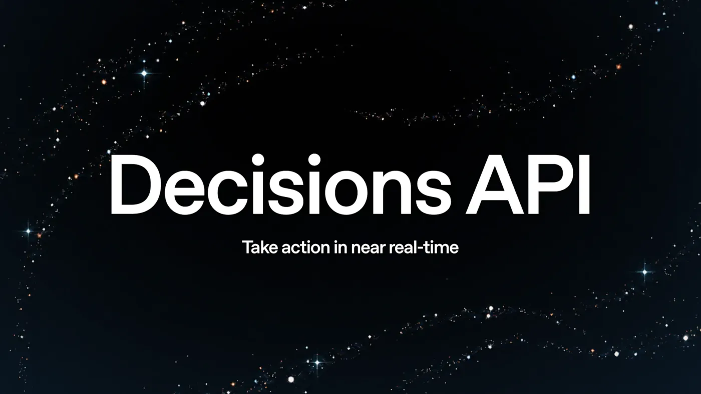
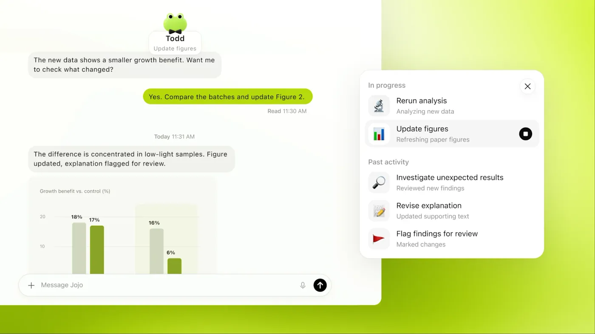

## 关注是不是给重置卡

今天早上起来第一件事是看 Codex 额度重置了没有，看到自己原来的 96% 余额还在，大呼一口气，和预期一样这次 OpenAI 选择发重置卡不是直接重置额度，现在社区对于直接重置额度抱怨得有点厉害，都说强制重置额度导致用户无法合理安排自己的额度并且强制延后下一次重置时间，还有对于一些刚自然重置的用户来说额度来不及使用这个重置就没有太多价值。

看着自己的五倍 Pro 账户里还有 2 张重置卡，加上剩余的 96% 额度，满满的安全感，足够支撑我干一段时间的活了。

现在我手上有俩个 ChatGPT 账号，一个 Plus，一个五倍 Pro ，两个账号都没有五小时限制，是不是非常的幸运？也不知道什么原因，其他同事的账号全有五小时限制，我的俩个都没有用起来太方便了，我之前问过 ChatGPT 它明确说 Pro 订阅也是有五小时限制的，所以可能是账号原因，总之没有五小时限制是个好事。

## ChatGPT Pro 500

昨天凌晨 OpenAI 在周二开了 DevDay 2026，今天媒体全在讨论发布会里的新消息，连股市都被 OpenAI 发布会影响到。对于普通人来说最先关注的还是有没有给重置，毕竟重置额度是实打实的权益，有额度才能干活，这次发重置卡好评，后续继续保持。

然后有个被吐槽死了的事是 OpenAI 要重新开放 200 刀订阅但是额度从之前的给 20x 现在只有 10x，这波把 20x 降到 10x 降得也太多了，之前 200 刀订阅的量大管饱现在性价比不高了。

之前因为工作中额度花费越来越多打算上 200 刀 Pro，然后犹豫了一下结果 OpenAI 暂停了 200 刀订阅直接上不了车，悔恨不已，更离谱的有渠道通过 iOS 强行订阅 200 刀 Pro 报价到了 1800，要知道 200 刀正常订阅和续费只要 1050，这溢价都快翻倍了，

无奈工作需要订阅了 5x 的 Pro 先用着，想着后面 OpenAI 资源压力小点后重新开放 200 刀再上车，结果重新开放直接被砍一刀，额度没优势了，还反手推出了 500 刀的超大杯，菲区报价来到了 ¥3100 一个月，有 25x 倍的额度，这下好了 500 刀的大概率不会买也太贵了，干什么项目能赚回 500 刀的价值啊，是时候看看 Claude 的订阅了。

## ChatGPT 6.1 Sol

发布会上还推出一款新模型，说实话 OpenAI 又出一款新模型基本上是 Claude 出的 Opus5.5 和 Sonnet5.5 给的压力太大，所以竟然在 ChatGPT6.0 Sol 出来才 7 天出了 ChatGPT6.1 Sol，这迭代速度没得说，6.0 Sol 应该是存活期最短的新模型了，立马被更便宜更强大的 6.1 Sol 替代。

也有人说 6.0 Sol 其实是 6.0 Terra，这波 6.1 Sol 才是真正的 6.0 Sol，说实话也是有这种可能的，毕竟 6.1 Sol 比 6.0 Sol 提升还是很明显的，短时间不可能训练好，这么快可能是有准备的，

6.1 Sol 在价格和能力上双双再上一个台阶，便宜且有更接近 Astra 的能力，而且缓存命中率高达 95%，而且费用也更低了，实际用下来消耗确实慢下来了，但是速度也着实太慢了，干啥都费劲，有种迈不开腿的感觉。

现在普通模式不管用什么模型感觉都很慢，随便一个任务要等个十几分钟，上 fast 模式又有点太奢侈，官方也知道自己现在的速度有多慢，还给 500 刀 Pro 推出专属的 ultra fast 模式，八倍速度只要六倍消耗，要花更多钱才能用上更快的速度。

## Decisions API

另外，OpenAI 还推出了 Decisions API，就是前段时间爆火的 Jev 的类似模型，不做生成输出，只做决策概率，底层基于 luna 模型支持多模态，说实话，这个领域 Jev 刚推出，作为大公司就立马跟进了对于 Jev 来说还是比较难受的，不过使用 luna 作为底座模型应该做不到比 Jev 定价便宜吧我猜测，但是多模态是优势，未来程序中应该会集成更多这类决策模型。

## ChatGPT Dots

还有就是要重点强调 OpenAI 终于也推出了自己云端智能体了，ChatGPT Dots 名字还挺不错，继 Grok Bot，Muse 后 OpenAI 也终于有了自己的 Dots，基于 Astra 模型，并且不消耗 Codex 额度还是不错的，作为高贵的 Pro 用户今天就已经体验上了。问题是只能创建一个 Primary Dot 不像 Grok Bots 可以创建多个 Bots，不过 Dots 除了控制自己的机器还能控制用户电脑，必要时会调用 Codex/Work 辅助完成工作这就会消耗额度了。

Muse 我当初是通过了申请但是没有相应信用卡可以通过 Facebook 的年龄认证所以没体验过，但是 Grok Bots 我是有用一段时间的，体验下来感觉是蛮丝滑的，做日常处理是不错的，这次的 Dots 采用 Astra 模型调用能力上比 Grok Bot 肯定要强得多，后面打算用它开发和重构项目试一试。

Dots 现在还处于早期阶段，对于额度还是比较足的，现在可以早点体验，说不定下个月之后调整，可能就没那么多额度，说不定要收费也不一定。

## 已有当前订阅

总结一下，现在我手上有 2 个 ChatGPT 账号， 一个 Plus，一个 5x Pro，基本是我的工作主力，非常吃 Tibo 重置，俩个 Google AI Pro 订阅，可以用 Gemini 3.8 flash，日常的笔记文章整理，写点小 demo 属于替补选手，期待 Gemini 4 Pro 出来拯救局面，一个 Cursor Pro+ 订阅，是 Cursor 的 3x 倍的套餐，可以用 Grok Bot 但是最近用的少了，Grok 4.7 能力速度都不达预期，没有 Codex 好用，后面可能不续了，AI 编程白月光 Cursor 要到此为止了吗？希望不要就此没落。

现在的额度是够的，但是真正能提高效率的可能就只有 Codex 的额度，其他的只能起到辅助作用，后续可能考虑订阅一个 Claude，一手 Codex 一手 Claude 这做起事来能不有效率嘛，时代变了，模型能力和工具带来的帮助太明显了，学会用好工具是新时代的重要能力，通过多实践多做项目，掌握使用 AI 提效落地成产品和服务的能力，像是掌握了把想法变成现实的魔法。
